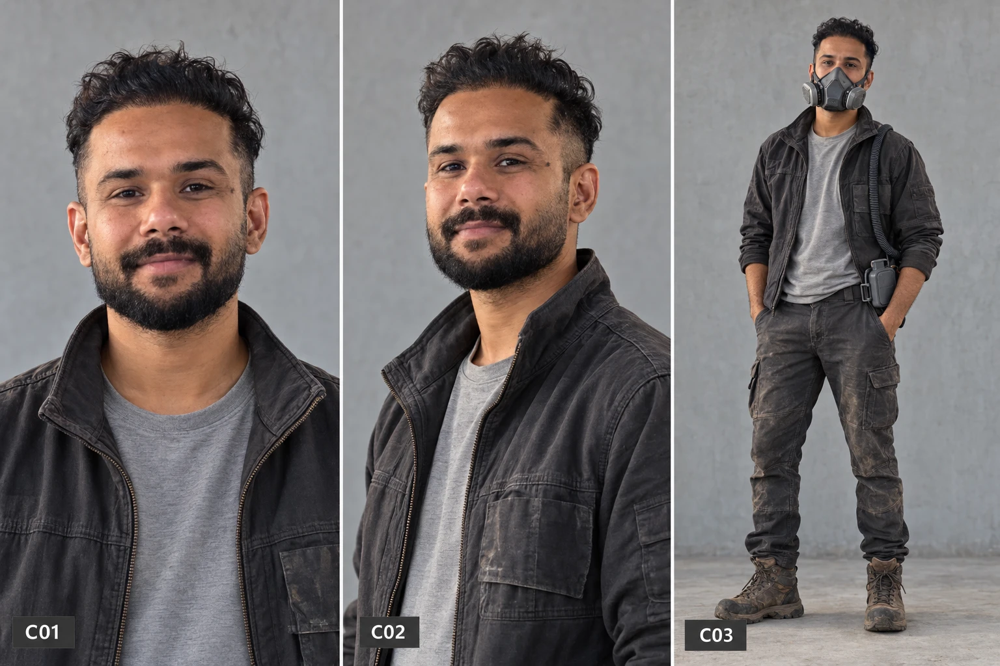

# FLUTTER — Protagonist

**Status:** Played by **Dharampal (DP)**. Look **LOCKED** from the reference sheet, [`reference/protagonist-C01-C03.webp`](reference/protagonist-C01-C03.webp). Name and pet are proposed and listed in [`05-decisions.md`](05-decisions.md).

---

## DP *(working name)*

The character's final name is **parked** and will be decided later. Until then, every document and storyboard calls him **DP**. The film is **universal**: no national, ethnic or cultural markers in the story, the world or the names.

| | |
|---|---|
| **Age** | 31 |
| **Address** | Tower 41 / Floor 786 / Residence 12, shown on screen as **41-786-12** |
| **Job** | Residential Environmental Systems Technician, Grade II |
| **Employer** | A building-services contractor certified by Preservation, so he's a tradesperson, not an official |
| **Lives with** | One bio-synthetic companion (feline pattern). See Decisions for its name. |
| **Elevation band** | Upper. Comfortable, a little lonely, well looked-after. |
| **Family** | Grandmother deceased, which is the source of the inherited tin. No partner. Parents not part of the story. |

---

## His job, and why it's the right job

DP installs, calibrates and repairs the systems that keep homes perfect: **air-quality sensors, humidity regulators, domestic filtration, and bio-compliance equipment.** Every day he goes into strangers' apartments and replaces the devices that watch them.

The job does three things for the story:

1. **Believable access.** His service calls take him into a **Contained agricultural floor**, where he can pick up a damaged pollination unit from a disposal tray.
2. **Expert knowledge.** He knows exactly what each sensor measures, where the **dead zones** are, and what every threshold means. When his own panel reads **0.021%, FLAGGED FOR REVIEW**, the audience doesn't need to understand the number. They watch *him* understand it.
3. **Built-in irony.** Each countermeasure he tries is something he's professionally trained to detect. He knows he's leaving a trail. He does it anyway.

---

## The apartment

**Technically perfect.** 21.0% oxygen. 45% humidity. Twenty-two degrees. Artificial daylight that rises and sets on schedule. A sealed window onto the beautiful amber haze. Pale stone, warm composite wood, frosted glass. A dispenser, a sterilisation port, a home panel.

**And emotionally sterile.** Nothing on the walls. Nothing out of place. No smell. Nothing that has ever grown, aged or stained.

### The hidden compartment

A **decommissioned humidity-regulator bay** behind a wall panel near the floor. It's about 60 cm wide, 40 cm high and 35 cm deep.

- **DP decommissioned it himself.** He logged the regulator as removed and its sensor as retired. It's a **sensor dead zone**, and he knows it because he made it.
- That is the habitat's only protection. Whatever happens *inside* the bay is invisible. Whatever *leaks out* (humidity, CO₂ change, movement, particles) is not.
- That's why the variance readings creep up instead of spiking. And it's why the creature becomes dangerous the moment it starts leaving the bay.

### The habitat (inventory)

It should look **almost pathetic**. It is not a lush greenhouse.

| Item | Detail |
|---|---|
| Soil | A handful, in a shallow composite tray. Dry at the edges. |
| Water | A small jar of **condensation collected from his own respirator**, emptied in every evening from the canister on his belt unit |
| The plant | One **wild strawberry** (*Fragaria vesca*): three leaves, one of them greying, one tired white flower. It has never fruited. |
| Moss | A thumb-sized patch on a stone, half grey |
| Light | A small lamp approximating sunlight, warmer than anything else in the apartment |
| Breath line | **His respirator's own corrugated hose.** He unclips it from the belt unit, adds a short extension and feeds it into the bay, so **the habitat runs on his breath** |
| The diagram | Handwritten, inherited, taped inside the panel door (see below) |
| The log | A **paper** notebook. Paper, because digital is monitored. |

**Why a wild strawberry:** the first food we see in the film is a pale protein "strawberry" from the dispenser. The real one is the answer to it. (Alternatives are in Decisions.)

### The inheritance: grandmother's tin

A small, dented metal tin. Inside:
- **The diagram.** A hand-drawn cycle in faded ink: *sun → plant → pollinator → seed → soil → water → sun*. The pollinator is drawn as a butterfly. DP has circled that link in his own hand and written next to it: **"impossible."**
- **Empty seed envelopes**, all used and all failed.
- **A sealed glass vial** in old cryo-wrap, labelled in his grandmother's handwriting. The label has a Latin name he has never looked up, and **a tiny drawn butterfly.** DP thinks it's spores or seed stock. The audience can see the drawing. He can't, or doesn't look.

We never explain who his grandmother was. One shot of the tin, the handwriting and the diagram is enough to say that someone before him tried too.

### The log

A record of failure in neat handwriting, shown in brief inserts:

> *Seed 7 — no germination.*
> *Fungal culture — collapsed day 4.*
> *Moss — grey. Watering?*
> *Leaf 2 — grey.*
> *Day 0 — last try.*

---

## Psychology

### What he is not

- **Not a revolutionary.** He has no politics he'd put into words. He's never met an activist.
- **Not a soldier.** He never fights anyone.
- **Not a scientist trying to overthrow the system.** He's a technician. He partly believes in the system: he has seen mould blooms in people's homes, and he knows the history.
- **Not a rebel against his life.** His life is fine. That's the problem.

### Why he does it

Not ideology. **Something closer to a private diary, or prayer.** Keeping the habitat is the one thing in his day that hasn't been designed for him. He's spent his whole working life measuring the *absence* of living things; the bay is the one place where he's trying to measure something present.

The diagram gives it a shape: he's trying to complete a cycle his grandmother drew. He has quietly accepted that he will only ever manage half of it.

### Want / Need / Flaw

| | |
|---|---|
| **Want** | To keep **one** living thing alive. To make the plant fruit. |
| **Need** | To accept that life can't be controlled, including by him. |
| **Flaw** | **He is a product of the system he's hiding from.** He runs the habitat the way the city runs him: measured, logged, rationed, controlled. That's why it keeps dying. |

### The arc: control → release

This is the key internal idea, and it mirrors the film's theme:

1. **He controls the habitat**, and it fails. Every experiment dies.
2. **He gives up** ("Day 0, last try") and **stops opening the bay.**
3. **While he isn't controlling it, life happens.** The chrysalis forms during the days he has abandoned it. *It works the moment he stops controlling it.*
4. **He tries to control again**, with countermeasures, taping and routing. Each attempt makes things worse and leaves a trail.
5. **His final act is a refusal, not a rebellion.** Offered amnesty if he destroys the creature, he simply **doesn't.** He closes the sterilisation port, sits down on the floor, holds it in his hands and waits. The most radical thing available to him is to **not kill something.**

---

## His relationship with the pet

The companion is the only other "living" presence in his apartment. It's warm, soft and affectionate on schedule. He's fond of it the way you're fond of a good appliance, but he also talks to it in body language: a hand on its back, a pause.

Its story job:
1. **Contrast.** Perfect, scheduled behaviour sits beside the creature's imperfect, unprogrammed movement.
2. **First witness.** The night of the emergence, the pet turns toward the wall *off schedule*. Its classification loop flickers and freezes. It doesn't know what it's looking at, and neither do we yet.
3. **Betrayal without malice.** During the hunt the system switches it into **sensor mode**, and it starts tracking the creature around the room with smooth, perfect head turns. DP has to **switch it off**: he puts out the only other "life" he has to protect the real one. It goes limp and stays warm.

---

## Performance notes

The film is **near-dialogue-free** (see Decisions), so everything is behavioural.

- **The glance.** He habitually checks the ceiling sensor dome when he enters a room. It's a professional tic, and later a fearful one.
- **The click.** He puts on his respirator without looking: mask to face, hose clipped to the belt unit, **click**, seal tone. The audience should be able to hear his mood in how he does it.
- **The reservoir.** Every evening he unclips the condensation canister from his belt unit and empties it into the habitat jar, not the drain. It's the first sign that something is off.
- **Hands in pockets.** His resting stance in the reference (C03) is relaxed and unbothered, hands deep in his jacket pockets. That's the man at the start of the film. By the hunt, his hands are never still.
- **Stillness.** His default state is easy and economical, with a warm, half-tired half-smile (C01–C02). When he finally breaks, it's small: a held breath, a hand that won't stop shaking.
- **Watching.** The 30-second emergence sequence is entirely his face watching. The reference face has soft, warm eyes that can hold a frame doing nothing. Protect that in every generation.
- **Breathing.** His breath is part of the sound design (see beats). The actor's breathing should be recorded wild and close in every scene.

---

## Canonical look *(LOCKED: reference sheet C01–C03)*

**Played by Dharampal (DP), the filmmaker.** The reference sheet is him.

Source: [`reference/protagonist-C01-C03.webp`](reference/protagonist-C01-C03.webp). C01 is a front head-and-shoulders, C02 is a three-quarter head-and-shoulders, and C03 is full body in the respirator. **Attach this sheet as the character reference in every generation of him.**

| Element | Locked from reference |
|---|---|
| **Age / build** | Early 30s. Average height, lean, relaxed posture. |
| **Skin** | Warm brown. Follow the reference exactly. |
| **Face** | Soft, warm dark-brown eyes with a slightly tired, kind expression. A gentle half-smile at rest. |
| **Hair** | Thick, dark, **curly and slightly unruly on top**, with shorter faded sides |
| **Facial hair** | **Full, short, neatly trimmed black beard** with a defined moustache |
| **Distinguishing mark** | A **small dark mark at the outer corner of his left eye** (screen right in C01). Keep it consistent in every shot. |
| **Jacket** | A **worn charcoal-black canvas work jacket**: stand collar, brass-toned zip worn open, chest flap pocket, sleeves pushed slightly up. **Faded and dusty**, with pale scuffs on the pocket and elbows. |
| **Shirt** | Plain **heather-grey crew-neck T-shirt** |
| **Trousers** | **Dark grey cargo work trousers** with side cargo pockets, dusty, worn pale at the knees and thighs |
| **Boots** | **Brown leather lace-up work boots**, scuffed and dusty |
| **Respirator (work-grade)** | A **grey half-face mask with twin side filter cartridges** over the nose and mouth. A **black corrugated hose** runs from the mask over his left shoulder and down to a **compact grey belt unit at his left hip** (filtration and condensation canister). See World Rules §5. |
| **At home** | **The same reference outfit, without the jacket and boots:** heather-grey T-shirt and dark-grey cargo trousers, barefoot. The jacket hangs by the door. No invented wardrobe; the reference is followed strictly in every scene. |

### Why his clothes are dirty in a spotless city

The world rules say the city has **no grime**. DP is the exception, and that's deliberate.

He services filters, ducts, humidity regulators and the inside of walls: **everywhere the city hides the dirt it removes from the air.** His work clothes carry that residue. In the lift (B4), surrounded by polished Upper-band residents in pale, clean clothing, **he's the only person in frame with dust on him.** He literally wears what the city doesn't want to see. That fits a man who keeps soil behind a wall panel.

**Rule:** The dust is **on his workwear only**: the jacket, trousers and boots. His **skin, hair and home are clean.** The air around him stays dust-free (the light rule still holds).
